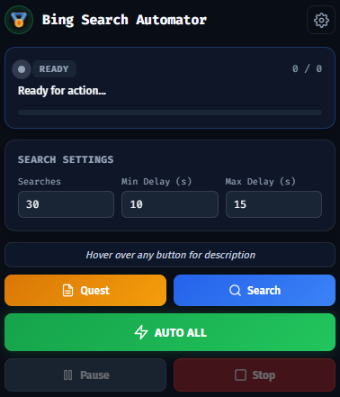

# Bing Search Automator

A Chrome/Edge extension that automates daily Microsoft Rewards tasks — Bing searches and dashboard quests/activities.

## ✨ Features

- **Auto Quest** — Automatically clicks all Daily Set & "Keep Earning" activity cards
- **Auto Search** — Performs Bing searches with natural, varied queries optimized for STAR Bonus
- **Auto All** — One-click: runs Quests first, then Search
- **STAR Bonus Optimized** — 90+ natural query categories, no-repeat pool, random result clicking, jittered delays
- **±10% Search Count Jitter** — Each session varies slightly to avoid detection patterns
- **Pause / Stop** — Full control over automation mid-run
- **Bilingual UI** — English / Tiếng Việt
- **Dark / Light Theme** — OLED-friendly dark mode by default

## 📸 Screenshot



## 🚀 Installation

### From Source (Developer Mode)

1. Clone or download this repository
2. Open `chrome://extensions/` (or `edge://extensions/`)
3. Enable **Developer mode** (toggle in top-right)
4. Click **Load unpacked**
5. Select the project folder

### Files

```
├── manifest.json        # Extension manifest (Manifest V3)
├── background.js        # Core automation engine
├── popup.html           # Popup UI structure
├── popup.css            # Popup styling (dark/light themes)
├── popup.js             # Popup logic, i18n, settings
├── data/
│   └── words.json       # External word list for queries
└── icons/
    ├── icon16.png
    ├── icon48.png
    └── icon128.png
```

## ⚙️ Configuration

| Setting | Default | Description |
|---------|---------|-------------|
| Searches | 30 | Number of Bing searches (±10% random jitter applied) |
| Min Delay | 10s | Minimum delay between searches |
| Max Delay | 15s | Maximum delay between searches |

## 🎯 How It Works

### Quest Engine
1. Opens the Microsoft Rewards dashboard (`rewards.bing.com`)
2. Scans for uncompleted cards in **Daily Set** and **Keep Earning** sections
3. Uses multi-strategy detection (ID selectors, heading text, ARIA labels)
4. Clicks each card via CDP (Chrome DevTools Protocol), waits for completion
5. Reloads dashboard and repeats until all cards are done

### Search Engine (STAR Bonus Optimized)
1. Creates a background tab
2. Performs searches with **natural, varied queries** across 10+ categories
3. No query repeats within the same session
4. **10% chance** of clicking a search result (signals genuine engagement)
5. Random scroll behavior simulating reading
6. Delays include **±30% jitter** to avoid fixed timing patterns

## 🔐 Permissions

| Permission | Why |
|-----------|-----|
| `debugger` | CDP clicks on quest cards (simulates real mouse events) |
| `activeTab` | Access to current tab |
| `scripting` | Inject scripts to scan dashboard cards and scroll pages |
| `storage` | Save user settings (search count, delay, language, theme) |
| `tabs` | Create/manage search tabs |
| `alarms` | (Reserved for future scheduled automation) |

## ⚠️ Disclaimer

This extension is for **educational and personal use only**. Automating Microsoft Rewards tasks may violate [Microsoft's Terms of Service](https://www.microsoft.com/en-us/servicesagreement/). Use at your own risk. The authors are not responsible for any account restrictions or bans.

## 📄 License

MIT License — see [LICENSE](LICENSE) for details.
