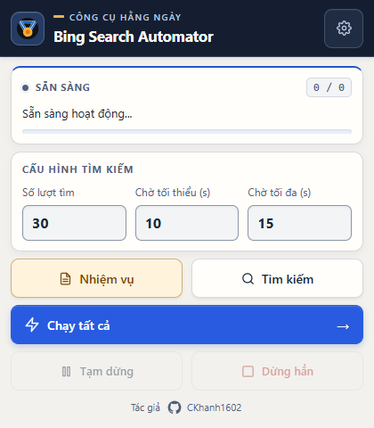

# Bing Search Automator

A Chrome/Edge extension that automates daily Microsoft Rewards tasks — Bing searches and dashboard quests/activities.

## ✨ Features

- **Quests** — Activates pending point-bearing Daily Set and Earn cards through the official flyout, including quiz-labelled cards, and verifies Rewards completion
- **Manual handoff** — Keeps unavailable or unconfirmed offers open with a small remaining-quest notice
- **Search** — Uses the configured search count and delay range, with a no-repeat query pool
- **Run all** — Runs Daily Set and Earn cards, leaves unconfirmed offers open, then continues searches
- **Pause / Stop** — Stop releases controls immediately; abandoned callbacks cannot affect a new run
- **Bilingual UI** — English / Tiếng Việt
- **Dark / Light Theme** — Graphite header, layered light/navy surfaces, cobalt primary action and amber quest control; popup content stays 420px wide
- **GitHub credit** — Profile link for CKhanh1602 in the popup footer

## 📸 Screenshot



## 🚀 Installation

### From Source (Developer Mode)

1. Clone or download this repository
2. Open `chrome://extensions/` (or `edge://extensions/`)
3. Enable **Developer mode** (toggle in top-right)
4. Click **Load unpacked**
5. Select the project folder

Current release: **2.0.1**. You can also extract the release ZIP and select the
extracted directory containing `manifest.json`. Reload an already installed
unpacked extension, then close and reopen its popup.

### Files

```
├── manifest.json        # Extension manifest (Manifest V3)
├── background.js        # Core automation engine
├── quest-api.js         # Rewards flyout/dashboard validation and activity filtering
├── quest-ui.js          # Official flyout card selection and authorized activation
├── popup.html           # Popup UI structure
├── popup.css            # Popup styling (dark/light themes)
├── popup.js             # Popup logic, i18n, settings
├── data/
│   └── words.json       # Bundled word list for queries
└── icons/
    ├── icon16.png
    ├── icon48.png
    └── icon128.png
```

## ⚙️ Configuration

| Setting | Default | Description |
|---------|---------|-------------|
| Searches | 30 | Exact number of Bing searches |
| Min Delay | 10s | Minimum delay between searches |
| Max Delay | 15s | Maximum delay between searches |
| Quest wait limit | 10s | Maximum wait for each activity load/API verification phase; configurable from 10–300 seconds |

## 🎯 How It Works

### Quest Engine
1. Requests the signed-in activity data from Bing's read-only Rewards flyout `getuserinfo` endpoint
2. Merges raw promotion data with dated `flyoutResult.dailySetPromotions`, including Daily Set cards omitted from the raw list
3. Rejects hidden, completed, zero-point, stale dated offers and destinations outside the Bing/Rewards allowlist
4. Plans one official card activation for enabled pending Daily Set and Earn offers; quiz labels, titles and URL shape do not decide whether a click can earn credit
5. Opens the official Bing Rewards flyout, refreshes each automatic offer by identity, and waits for a unique visible pending card matching current URL, title and points
6. Activates the actual card through Bing's own handler, then requires two affirmative completion responses before increasing progress
7. Leaves unavailable/custom controls and unconfirmed activities for inspection without counting them as complete; it never answers a quiz or automates destination interactions

A per-run guard uses the actual matched card URL, title and points to avoid
replaying a handler when raw and rendered API records describe the same card.
Offers with distinct identities are not merged by URL alone. A new user-started
run can rescan the current pending cards.

The remaining-quest notice records the handoff at the end of this run. Check
Rewards for manual completion; the extension does not keep monitoring those
tabs. There is no monitoring window. Closing/reopening the normal popup preserves
the current run state and settings.

A completed offer is verified before counting and is not clicked again. A missing,
ambiguous or changed card stays unconfirmed while later offers continue. Conflicting
metadata cannot select an arbitrary destination. Readiness logs contain only card
counts and error categories; default per-phase wait remains 10 seconds.

An Edge profile tested on 2026-10-02 blocked extension scripts on `rewards.bing.com`.
Auto Quest uses the official `www.bing.com/rewards/panelflyout` UI instead. Its
card handler processes activities before navigation; the worker never calls a
reporting/claim endpoint or edits account data. Only the known site transformation
of `FORM` is ignored when matching URLs; ambiguous cards are not clicked.
The worker authorizes each click once for the exact tab/document. Pause or Stop
denies queued authorizations. An action already authorized immediately before
Stop may finish within its short lease; the next card cannot start.

The worker saves progress locally. A worker/extension restart explicitly stops an
interrupted run rather than replaying clicks. Start again to rescan. Sign-in,
browser restrictions, network failures and uncertain activation failures stop the
run with an error; an individual unavailable card does not discard partial progress.
See [verification evidence](docs/auto-quest-fix.md) and [Edge manual QA](docs/edge-qa.md).

Development checks (Node 22+; no dependency installation needed):
`npm test` and `npm run check`. This plain JavaScript extension has no bundling,
TypeScript or ESLint configuration.

Optional isolated Edge integration test (requires Playwright and installed Edge):
`node scripts/edge-smoke.cjs`. It uses a fresh profile and synthetic Rewards
responses to test the actual unpacked worker/popup; it does not prove live credit.
Set `PLAYWRIGHT_MODULE` to an installed Playwright module path if it is not on
Node's module search path. Screenshots go to ignored `.qa/`.
Set `EDGE_PATH` to your Edge executable if it is installed outside the default
Windows path. The browser checks are optional and require an installed browser.

`node scripts/popup-layout.cjs` also opens the actual toolbar popup in isolated
Edge to catch intrinsic sizing regressions that a fixed-size browser tab misses.
It checks English/Vietnamese, both themes, text contrast, settings scrolling and
long error messages. Reload the extension and close/reopen its popup after a UI update.

`npm run package:extension` produces `dist/bing-search-automator-2.0.1.zip`
using an explicit runtime-file allowlist. Tests, browser profiles and development
tools are excluded. See [GitHub preparation](docs/github-preparation.md) before
publishing. GitHub Actions checks syntax, assets, tests and packaging on Node 22
and 24; authenticated Rewards checks remain manual.

### Search Engine
1. Creates a background tab
2. Performs searches with **natural, varied queries** across 10+ categories
3. No query repeats within the same session
4. Uses the exact configured search count and a delay within the configured range
5. Performs no simulated reading, scrolling or random result clicking

## 🔐 Permissions

| Permission | Why |
|-----------|-----|
| `scripting` | Inspect and activate official Bing flyout cards |
| `storage` | Save settings and run progress for popup synchronization and interruption recovery |
| `tabs` | Create/manage search tabs |
| Bing host access | Access `https://www.bing.com/*` and `https://bing.com/*` for searches and the official Rewards flyout |

## ⚠️ Disclaimer

This extension is for **educational and personal use only**. Automating Microsoft Rewards tasks may violate [Microsoft's Terms of Service](https://www.microsoft.com/en-us/servicesagreement/). Use at your own risk. The authors are not responsible for any account restrictions or bans.

## 📄 License

MIT License — see [LICENSE](LICENSE) for details.
